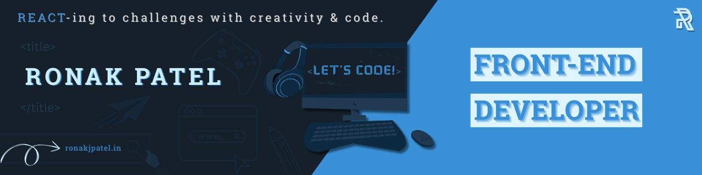

# 💫 About Me:

 Hi, I am [Ronak Patel](https://ronakjpatel.in/) a passionate software engineer with experience in Python, Java, and web development. I currently work at Capgemini, where I am constantly learning and implementing new technologies to create efficient and effective software solutions.

## 🌐 Socials:

# 💻 Tech Stack:
              	      
# 📊 GitHub Stats:
 
 

## 🏆 GitHub Trophies

---

<!-- Proudly created with GPRM ( https://gprm.itsvg.in ) -->
